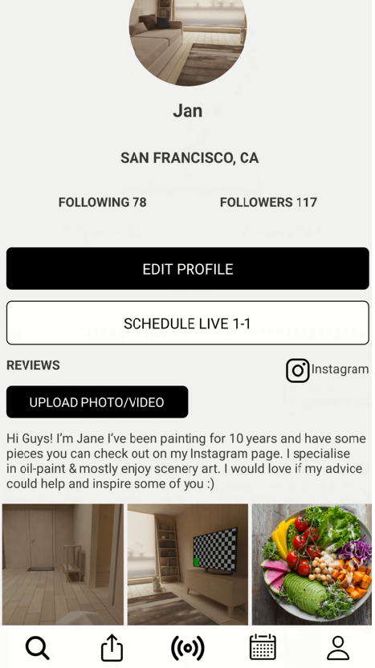

# React Native Mobile App

This is a react native social media app using firebase. With full authorisation, create, read and update functionalitly.

 

Users are able to create profiles, upload images and view other users profiles.

## Prerequisites

1. You have successfully completed setting up your React Native development environment using [the official documentation](https://reactnative.dev/docs/environment-setup).

2. You have a [Firebase account](https://console.firebase.google.com/).

## Setting up the development environment

1. Clone the repository.
  `git clone git@github.com:JNelsonnn/RN.git` 

2. From the root directory, install the project dependencies.
  `yarn install`

3. Create a new Firebase project and follow the 'SDK setup and configuration' guides for both Android and iOS.

4. Run the project.
  `npx react-native run-android`
